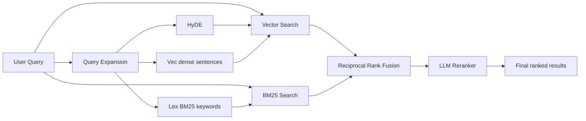

# QMD - Query Markup Documents

An on-device search engine for everything you need to remember. Index your markdown notes, meeting transcripts, documentation, and knowledge bases. Search with keywords or natural language. Ideal for your agentic flows.

QMD combines BM25 full-text search, vector semantic search, and LLM re-ranking—all running locally via node-llama-cpp with GGUF models.



Typed expansions are routed exclusively: `lex` → BM25/FTS, `vec` and `hyde` → vector search. The original query is sent to both backends, then fused with RRF and reranked.

You can read more about QMD's progress in the [CHANGELOG](CHANGELOG.md).

## Quick Start

```sh
# Install globally (Node or Bun)
npm install -g @tobilu/qmd
# or
bun install -g @tobilu/qmd

# Or run directly
npx @tobilu/qmd ...
bunx @tobilu/qmd ...

# Create collections for your notes, docs, and meeting transcripts
qmd collection add ~/notes --name notes
qmd collection add ~/Documents/meetings --name meetings
qmd collection add ~/work/docs --name docs

# Add context to help with search results, each piece of context will be returned when matching sub documents are returned. This works as a tree. This is the key feature of QMD as it allows LLMs to make much better contextual choices when selecting documents. Don't sleep on it!
qmd context add qmd://notes "Personal notes and ideas"
qmd context add qmd://meetings "Meeting transcripts and notes"
qmd context add qmd://docs "Work documentation"

# Generate embeddings for semantic search
qmd embed

# Search across everything
qmd search "project timeline"           # Fast keyword search
qmd vsearch "how to deploy"             # Semantic search
qmd query "quarterly planning process"  # Hybrid + reranking (best quality)

# Get a specific document
qmd get "meetings/2024-01-15.md"

# Get a document by docid (shown in search results)
qmd get "#abc123"

# Get multiple documents by glob pattern
qmd multi-get "journals/2025-05*.md"

# Search within a specific collection
qmd search "API" -c notes

# Export all matches for an agent
qmd search "API" --all --files --min-score 0.3
```

### Using with AI Agents

QMD's `--json` and `--files` output formats are designed for agentic workflows:

```sh
# Get structured results for an LLM
qmd search "authentication" --json -n 10

# List all relevant files above a threshold
qmd query "error handling" --all --files --min-score 0.4

# Retrieve full document content
qmd get "docs/api-reference.md" --full
```

### MCP Server

Although the tool works perfectly fine when you just tell your agent to use it on the command line, it also exposes an MCP (Model Context Protocol) server for tighter integration.

**Tools exposed:**
- `query` — Search with typed sub-queries (`lex`/`vec`/`hyde`), combined via RRF + reranking
- `get` — Retrieve a document by path or docid (with fuzzy matching suggestions)
- `multi_get` — Batch retrieve by glob pattern, comma-separated list, or docids
- `status` — Index health and collection info, including each collection's top metadata keys
- `metadata` — Discover metadata keys, types, and value counts to filter on

**Claude Desktop configuration** (`~/Library/Application Support/Claude/claude_desktop_config.json`):

```json
{
  "mcpServers": {
    "qmd": {
      "command": "qmd",
      "args": ["mcp"]
    }
  }
}
```

**Claude Code** — Install the plugin (recommended):

```bash
claude plugin marketplace add tobi/qmd
claude plugin install qmd@qmd
```

Or configure MCP manually in `~/.claude/settings.json`:

```json
{
  "mcpServers": {
    "qmd": {
      "command": "qmd",
      "args": ["mcp"]
    }
  }
}
```

#### HTTP Transport

By default, QMD's MCP server uses stdio (launched as a subprocess by each client). For a shared, long-lived server that avoids repeated model loading, use the HTTP transport:

```sh
# Foreground (Ctrl-C to stop)
qmd mcp --http                    # localhost:8181
qmd mcp --http --port 8080        # custom port
qmd mcp --http --host 0.0.0.0     # bind all interfaces (e.g. container probes)

# Background daemon
qmd mcp --http --daemon           # start, writes PID to ~/.cache/qmd/mcp.pid
qmd mcp stop                      # stop via PID file
qmd status                        # shows "MCP: running (PID ...)" when active
```

The server binds to `localhost` by default. Pass `--host` (or set the `QMD_HOST`
environment variable) to override — `--host 0.0.0.0` is useful when the server
runs in a container and a liveness probe connects from a non-loopback address.

The HTTP server exposes two endpoints:
- `POST /mcp` — MCP Streamable HTTP (JSON responses, stateless)
- `POST /query` (alias `/search`) — structured search without the MCP protocol. Accepts the same optional `filter` object as the `query` tool (invalid filters return `400`); see [Metadata Filtering](#metadata-filtering)
- `POST /metadata` — metadata discovery without the MCP protocol. Same body as the `metadata` tool (invalid filters return `400`); see [Metadata Discovery](#metadata-discovery)
- `GET /health` — liveness check with uptime


##### Origin and Host validation

Every request is screened before routing: a request carrying an `Origin` header
that does not name a loopback address is rejected with `403`, as is a `Host`
header naming something other than the address the server is bound to. This is
what stops a web page you visit from reading your index through DNS rebinding —
loopback binding alone does not, since the browser makes the request from your
own machine.

Requests without an `Origin` header — curl, MCP clients, editors — are
unaffected, which covers every normal local client.

| Variable | Effect |
|----------|--------|
| `QMD_ALLOWED_ORIGINS` | Comma-separated origins to accept in addition to loopback, e.g. `https://notes.internal`. Set to `*` to disable the check entirely. |
| `QMD_ALLOWED_HOSTS` | Comma-separated `Host` values to accept in addition to loopback and the bind address. |

`--host 0.0.0.0` cannot know which `Host` values are legitimate, so it skips the
host check and warns at startup. Set `QMD_ALLOWED_HOSTS` to re-enable it, and
remember the endpoints are unauthenticated — put your own auth in front of a
server that is reachable off-host.

LLM models stay loaded in VRAM across requests. Embedding/reranking contexts are disposed after 5 min idle and transparently recreated on the next request (~1s penalty, models remain loaded).

Point any MCP client at `http://localhost:8181/mcp` to connect.

#### MCP Tool Parameters

| Tool | Parameter | Type | Notes |
|------|-----------|------|-------|
| `query` | `searches` | array | Typed sub-queries (`lex`/`vec`/`hyde`), 1–10. **Required.** First gets 2x weight. |
| `query` | `collections` | string[] | Filter by collection names (OR). **Array only** — singular `collection` is silently ignored. |
| `query` | `filter` | object | Metadata filter (recursive `operator`-discriminated JSON AST; see [Metadata Filtering](#metadata-filtering)) |
| `query` | `intent` | string | Disambiguation context (does not search on its own) |
| `query` | `limit` | number | Max results (default 10) |
| `query` | `minScore` | number | Minimum relevance 0–1 (default 0) |
| `query` | `candidateLimit` | number | Max candidates to rerank (default 40) |
| `query` | `rerank` | boolean | Run LLM reranking (default **true**); set false for RRF-only |
| `get` | `file` | string | Path, docid (`#abc123`), or `path:from:count` (e.g. `#abc123:120:40`) |
| `get` | `fromLine` | number | Start line (1-indexed); overrides the `:from` suffix |
| `get` | `maxLines` | number | Limit returned lines |
| `get` | `lineNumbers` | boolean | Prefix lines with numbers (default **true**) |
| `multi_get` | `pattern` | string | Glob pattern or comma-separated list |
| `multi_get` | `maxBytes` | number | Skip files larger than N (default 10240) |
| `multi_get` | `maxLines` | number | Limit lines per file |
| `multi_get` | `lineNumbers` | boolean | Prefix lines with numbers (default **true**) |
| `metadata` | `collections` | string[] | Restrict discovery to collection names (default: the collections `query` searches) |
| `metadata` | `match` | object | Report only metadata entries matching this condition (same AST as `filter`, with `field` naming the entry's `key` or `value`) |
| `metadata` | `filter` | object | Count only documents matching this filter (same AST as `query`) |
| `metadata` | `keyLimit` | number | Keys reported (default 50). `totalKeys` and `remainingKeys` describe the rest |
| `metadata` | `keyOffset` | number | Keys skipped before the window, in report order (default 0) |
| `metadata` | `valueLimit` | number | Values reported per key and type (default 10). `remainingValues` reports the rest |
| `metadata` | `valueOffset` | number | Values skipped per key and type before the window, in `sort` order (default 0) |
| `metadata` | `sort` | string | `count` (default) or `value` |
| `metadata` | `minCount` | number | Hide values held by fewer documents (default 1) |

Unknown parameters are silently ignored (not rejected) — double-check names if
results seem unscoped. The HTTP `/query` and `/search` endpoints return
`qmd://collection/path` URIs in the `file` field, matching the CLI and MCP output.

### SDK / Library Usage

Use QMD as a library in your own Node.js or Bun applications.

#### Installation

```sh
npm install @tobilu/qmd
```

#### Quick Start

```typescript
import { createStore } from '@tobilu/qmd'

const store = await createStore({
  dbPath: './my-index.sqlite',
  config: {
    collections: {
      docs: { path: '/path/to/docs', pattern: '**/*.md' },
    },
  },
})

const results = await store.search({ query: "authentication flow" })
console.log(results.map(r => `${r.title} (${Math.round(r.score * 100)}%)`))

await store.close()
```

#### Store Creation

`createStore()` accepts three modes:

```typescript
import { createStore } from '@tobilu/qmd'

// 1. Inline config — no files needed besides the DB
const store = await createStore({
  dbPath: './index.sqlite',
  config: {
    collections: {
      docs: { path: '/path/to/docs', pattern: '**/*.md' },
      notes: { path: '/path/to/notes' },
    },
  },
})

// 2. YAML config file — collections defined in a file
const store2 = await createStore({
  dbPath: './index.sqlite',
  configPath: './qmd.yml',
})

// 3. DB-only — reopen a previously configured store
const store3 = await createStore({ dbPath: './index.sqlite' })
```

#### Search

The unified `search()` method handles both simple queries and pre-expanded structured queries:

```typescript
// Simple query — auto-expanded via LLM, then BM25 + vector + reranking
const results = await store.search({ query: "authentication flow" })

// With options
const results2 = await store.search({
  query: "rate limiting",
  intent: "API throttling and abuse prevention",
  collection: "docs",
  limit: 5,
  minScore: 0.3,
  explain: true,
})

// Pre-expanded queries — skip auto-expansion, control each sub-query
const results3 = await store.search({
  queries: [
    { type: 'lex', query: '"connection pool" timeout -redis' },
    { type: 'vec', query: 'why do database connections time out under load' },
  ],
  collections: ["docs", "notes"],
})

// Skip reranking for faster results
const fast = await store.search({ query: "auth", rerank: false })

// Metadata filter — every returned result satisfies it (also available on
// searchLex() and searchVector()); results expose indexed metadata via
// r.metadata. See "Metadata Filtering" for the full grammar.
const published = await store.search({
  query: "authentication flow",
  filter: {
    operator: "and",
    operands: [
      { field: "topics", operator: "all", value: ["typescript"] },
      { field: "status", operator: "ne", value: "draft" },
    ],
  },
})
```

For direct backend access:

```typescript
// BM25 keyword search (fast, no LLM)
const lexResults = await store.searchLex("auth middleware", { limit: 10 })

// Vector similarity search (embedding model, no reranking)
const vecResults = await store.searchVector("how users log in", { limit: 10 })

// Manual query expansion for full control
const expanded = await store.expandQuery("auth flow", { intent: "user login" })
const results4 = await store.search({ queries: expanded })
```

#### Retrieval

```typescript
// Get a document by path or docid
const doc = await store.get("docs/readme.md")
const byId = await store.get("#abc123")

if (!("error" in doc)) {
  console.log(doc.title, doc.displayPath, doc.context)
}

// Get document body with line range
const body = await store.getDocumentBody("docs/readme.md", {
  fromLine: 50,
  maxLines: 100,
})

// Batch retrieve by glob or comma-separated list
const { docs, errors } = await store.multiGet("docs/**/*.md", {
  maxBytes: 20480,
})
```

#### Collections

```typescript
// Add a collection
await store.addCollection("myapp", {
  path: "/src/myapp",
  pattern: "**/*.ts",
  ignore: ["node_modules/**", "*.test.ts"],
})

// List collections with document stats
const collections = await store.listCollections()
// => [{ name, pwd, glob_pattern, doc_count, active_count, last_modified, includeByDefault }]

// Get names of collections included in queries by default
const defaults = await store.getDefaultCollectionNames()

// Remove / rename
await store.removeCollection("myapp")
await store.renameCollection("old-name", "new-name")
```

#### Context

Context adds descriptive metadata that improves search relevance and is returned alongside results:

```typescript
// Add context for a path within a collection
await store.addContext("docs", "/api", "REST API reference documentation")

// Set global context (applies to all collections)
await store.setGlobalContext("Internal engineering documentation")

// List all contexts
const contexts = await store.listContexts()
// => [{ collection, path, context }]

// Remove context
await store.removeContext("docs", "/api")
await store.setGlobalContext(undefined)  // clear global
```

#### Indexing

```typescript
// Re-index collections by scanning the filesystem
const result = await store.update({
  collections: ["docs"],  // optional — defaults to all
  onProgress: ({ collection, file, current, total }) => {
    console.log(`[${collection}] ${current}/${total} ${file}`)
  },
})
// => { collections, indexed, updated, unchanged, removed, needsEmbedding }

// Generate vector embeddings
const embedResult = await store.embed({
  force: false,           // true to re-embed everything
  chunkStrategy: "auto",  // "regex" (default) or "auto" (AST for code files)
  onProgress: ({ current, total, collection }) => {
    console.log(`Embedding ${current}/${total}`)
  },
})
```

#### Types

Key types exported for SDK consumers:

```typescript
import type {
  QMDStore,            // The store interface
  SearchOptions,       // Options for search()
  LexSearchOptions,    // Options for searchLex()
  VectorSearchOptions, // Options for searchVector()
  HybridQueryResult,   // Search result with score, snippet, context
  SearchResult,        // Result from searchLex/searchVector
  ExpandedQuery,       // Typed sub-query { type: 'lex'|'vec'|'hyde', query }
  DocumentResult,      // Document metadata + body
  DocumentNotFound,    // Error with similarFiles suggestions
  MultiGetResult,      // Batch retrieval result
  UpdateProgress,      // Progress callback info for update()
  UpdateResult,        // Aggregated update result
  EmbedProgress,       // Progress callback info for embed()
  EmbedResult,         // Embedding result
  StoreOptions,        // createStore() options
  CollectionConfig,    // Inline config shape
  IndexStatus,         // From getStatus()
  IndexHealthInfo,     // From getIndexHealth()
} from '@tobilu/qmd'
```

Utility exports:

```typescript
import {
  extractSnippet,              // Extract a relevant snippet from text
  addLineNumbers,              // Add line numbers to text
  DEFAULT_MULTI_GET_MAX_BYTES, // Default max file size for multiGet (64KB)
  Maintenance,                 // Database maintenance operations
} from '@tobilu/qmd'
```

#### Lifecycle

```typescript
// Close the store — disposes LLM models and DB connection
await store.close()
```

The SDK requires explicit `dbPath` — no defaults are assumed. This makes it safe to embed in any application without side effects.

## Architecture

```
┌─────────────────────────────────────────────────────────────────────────────┐
│                         QMD Hybrid Search Pipeline                          │
└─────────────────────────────────────────────────────────────────────────────┘

                              ┌─────────────────┐
                              │   User Query    │
                              └────────┬────────┘
                                       │
                        ┌──────────────┴──────────────┐
                        ▼                             ▼
               ┌────────────────┐            ┌────────────────┐
               │ Query Expansion│            │  Original Query│
               │  (fine-tuned)  │            │   (×2 weight)  │
               └───────┬────────┘            └───────┬────────┘
                       │                             │
                       │ 2 alternative queries       │
                       └──────────────┬──────────────┘
                                      │
              ┌───────────────────────┼───────────────────────┐
              ▼                       ▼                       ▼
     ┌─────────────────┐     ┌─────────────────┐     ┌─────────────────┐
     │ Original Query  │     │ Expanded Query 1│     │ Expanded Query 2│
     └────────┬────────┘     └────────┬────────┘     └────────┬────────┘
              │                       │                       │
      ┌───────┴───────┐       ┌───────┴───────┐       ┌───────┴───────┐
      ▼               ▼       ▼               ▼       ▼               ▼
  ┌───────┐       ┌───────┐ ┌───────┐     ┌───────┐ ┌───────┐     ┌───────┐
  │ BM25  │       │Vector │ │ BM25  │     │Vector │ │ BM25  │     │Vector │
  │(FTS5) │       │Search │ │(FTS5) │     │Search │ │(FTS5) │     │Search │
  └───┬───┘       └───┬───┘ └───┬───┘     └───┬───┘ └───┬───┘     └───┬───┘
      │               │         │             │         │             │
      └───────┬───────┘         └──────┬──────┘         └──────┬──────┘
              │                        │                       │
              └────────────────────────┼───────────────────────┘
                                       │
                                       ▼
                          ┌───────────────────────┐
                          │   RRF Fusion + Bonus  │
                          │  Original query: ×2   │
                          │  Top-rank bonus: +0.05│
                          │     Top 30 Kept       │
                          └───────────┬───────────┘
                                      │
                                      ▼
                          ┌───────────────────────┐
                          │    LLM Re-ranking     │
                          │  (qwen3-reranker)     │
                          │  Yes/No + logprobs    │
                          └───────────┬───────────┘
                                      │
                                      ▼
                          ┌───────────────────────┐
                          │  Position-Aware Blend │
                          │  Top 1-3:  75% RRF    │
                          │  Top 4-10: 60% RRF    │
                          │  Top 11+:  40% RRF    │
                          └───────────────────────┘
```

## Score Normalization & Fusion

### Search Backends

| Backend | Raw Score | Conversion | Range |
|---------|-----------|------------|-------|
| **FTS (BM25)** | SQLite FTS5 BM25 | `Math.abs(score)` | 0 to ~25+ |
| **Vector** | Cosine distance | `1 / (1 + distance)` | 0.0 to 1.0 |
| **Reranker** | LLM 0-10 rating | `score / 10` | 0.0 to 1.0 |

### Fusion Strategy

The `query` command uses **Reciprocal Rank Fusion (RRF)** with position-aware blending:

1. **Query Expansion**: Original query (×2 for weighting) + 1 LLM variation
2. **Parallel Retrieval**: Each query searches both FTS and vector indexes
3. **RRF Fusion**: Combine all result lists using `score = Σ(1/(k+rank+1))` where k=60
4. **Top-Rank Bonus**: Documents ranking #1 in any list get +0.05, #2-3 get +0.02
5. **Top-K Selection**: Take top 30 candidates for reranking
6. **Re-ranking**: LLM scores each document (yes/no with logprobs confidence)
7. **Position-Aware Blending**:
   - RRF rank 1-3: 75% retrieval, 25% reranker (preserves exact matches)
   - RRF rank 4-10: 60% retrieval, 40% reranker
   - RRF rank 11+: 40% retrieval, 60% reranker (trust reranker more)

**Why this approach**: Pure RRF can dilute exact matches when expanded queries don't match. The top-rank bonus preserves documents that score #1 for the original query. Position-aware blending prevents the reranker from destroying high-confidence retrieval results.

### Score Interpretation

| Score | Meaning |
|-------|---------|
| 0.8 - 1.0 | Highly relevant |
| 0.5 - 0.8 | Moderately relevant |
| 0.2 - 0.5 | Somewhat relevant |
| 0.0 - 0.2 | Low relevance |

## Requirements

### System Requirements

- **Node.js** >= 22
- **Bun** >= 1.0.0
- **macOS**: Homebrew SQLite (for extension support)
  ```sh
  brew install sqlite
  ```

### GGUF Models (via node-llama-cpp)

QMD uses three local GGUF models (auto-downloaded on first use):

| Model | Purpose | Size |
|-------|---------|------|
| `embeddinggemma-300M-Q8_0` | Vector embeddings (default) | ~300MB |
| `qwen3-reranker-0.6b-q8_0` | Re-ranking | ~640MB |
| `qmd-query-expansion-1.7B-q4_k_m` | Query expansion (fine-tuned) | ~1.1GB |

Models are downloaded from HuggingFace and cached in `~/.cache/qmd/models/`.

### Custom Embedding Model

Override the default embedding model via the `QMD_EMBED_MODEL` environment variable.
This is useful for multilingual corpora (e.g. Chinese, Japanese, Korean) where
`embeddinggemma-300M` has limited coverage.

```sh
# Use Qwen3-Embedding-0.6B for better multilingual (CJK) support
export QMD_EMBED_MODEL="hf:Qwen/Qwen3-Embedding-0.6B-GGUF/Qwen3-Embedding-0.6B-Q8_0.gguf"

# After changing the model, re-embed all collections:
qmd embed -f
```

Supported model families:
- **embeddinggemma** (default) — English-optimized, small footprint
- **Qwen3-Embedding** — Multilingual (119 languages including CJK), MTEB top-ranked

> **Note:** When switching embedding models, you must re-index with `qmd embed -f`
> since vectors are not cross-compatible between models. The prompt format is
> automatically adjusted for each model family.

## Installation

```sh
npm install -g @tobilu/qmd
# or
bun install -g @tobilu/qmd
```

### Development

```sh
git clone https://github.com/tobi/qmd
cd qmd
npm install
npm link
```

## Usage

### Collection Management

```sh
# Create a collection from current directory
qmd collection add . --name myproject

# Create a collection with explicit path and custom glob mask
qmd collection add ~/Documents/notes --name notes --mask "**/*.md"

# Comma-separated masks are a union (brace form `{a,b}` also works)
qmd collection add ~/notes --name notes --mask "sources/**/*.md,CO - *.md"

# List all collections
qmd collection list

# Remove a collection
qmd collection remove myproject

# Rename a collection
qmd collection rename myproject my-project

# List files in a collection
qmd ls notes
qmd ls notes/subfolder

# Show collection details (path, glob mask, include status, context count, top metadata keys)
qmd collection show notes

# Discover metadata keys, types, and value counts (see Metadata Discovery)
qmd collection metadata notes
qmd collection metadata notes --match '{"field":"key","operator":"eq","value":"topics"}'
qmd collection metadata notes --match '{"field":"value","operator":"eq","value":"docs-team"}'

# Include or exclude a collection from default (unscoped) queries
qmd collection include notes
qmd collection exclude notes

# Run a command before every `qmd update` (e.g. git pull); empty arg clears it
qmd collection update-cmd notes 'git pull --rebase'
qmd collection update-cmd notes
```

### Generate Vector Embeddings

```sh
# Embed all indexed documents (900 tokens/chunk, 15% overlap)
qmd embed

# Force re-embed everything
qmd embed -f

# Enable AST-aware chunking for code files (TS, JS, Python, Go, Rust)
qmd embed --chunk-strategy auto

# Also works with query for consistent chunk selection
qmd query "auth flow" --chunk-strategy auto

# Memory control for large corpora / constrained systems
qmd embed --max-docs-per-batch 50   # cap docs per embedding batch
qmd embed --max-batch-mb 64         # cap batch size in MB
```

**AST-aware chunking** (`--chunk-strategy auto`) uses tree-sitter to chunk code
files at function, class, and import boundaries instead of arbitrary text
positions. This produces higher-quality chunks and better search results for
codebases. Markdown and other file types always use regex-based chunking
regardless of strategy.

The default is `regex` (existing behavior). Use `--chunk-strategy auto` to
opt in. Run `qmd status` to verify which grammars are available.

> **Note:** Tree-sitter grammars are optional dependencies. If they are not
> installed, `--chunk-strategy auto` falls back to regex-only chunking
> automatically. Tested on both Node.js and Bun.

### Context Management

Context adds descriptive metadata to collections and paths, helping search understand your content.

```sh
# Add context to a collection (using qmd:// virtual paths)
qmd context add qmd://notes "Personal notes and ideas"
qmd context add qmd://docs/api "API documentation"

# Add context from within a collection directory
cd ~/notes && qmd context add "Personal notes and ideas"
cd ~/notes/work && qmd context add "Work-related notes"

# Add global context (applies to all collections)
qmd context add / "Knowledge base for my projects"

# List all contexts
qmd context list

# Remove context
qmd context rm qmd://notes/old
```

### Configuring `index.yml`

The `collection` and `context` commands above all read and write a single YAML
config file — you can also edit it directly. Everything QMD knows about your
collections (paths, masks, exclusions, per-collection update hooks, contexts, and
optional model overrides) lives here. A fully-commented starter template ships as
[`example-index.yml`](example-index.yml) in this repo.

**Location:** `~/.config/qmd/index.yml` by default. The directory honors
`XDG_CONFIG_HOME` (→ `$XDG_CONFIG_HOME/qmd/index.yml`) and `QMD_CONFIG_DIR`. A
named index uses `{name}.yml` — `qmd --index work …` reads/writes `work.yml`.
A **project-local** index created with `qmd init` lives at `.qmd/index.yml`
(`.qmd/index.yaml` is also accepted) alongside a project-local `index.sqlite`,
so config and index stay inside the project instead of `~/.config` / `~/.cache`.

```yaml
# ~/.config/qmd/index.yml

# Context applied to every collection (system-message style). Optional.
global_context: "Knowledge base for my projects"

# Terminal hyperlink template for search results. Optional.
# Overridden by the QMD_EDITOR_URI env var. See "Editor Links" below.
editor_uri: "vscode://file{path}:{line}:{col}"

# Override the default GGUF models per role. Optional — omit to use the
# built-in defaults. `qmd init` writes this block pre-filled with the
# resolved defaults. See "Model Configuration" for the default URIs.
models:
  embed: "hf:ggml-org/embeddinggemma-300M-GGUF/embeddinggemma-300M-Q8_0.gguf"
  rerank: "hf:ggml-org/Qwen3-Reranker-0.6B-Q8_0-GGUF/qwen3-reranker-0.6b-q8_0.gguf"
  generate: "hf:tobil/qmd-query-expansion-1.7B-gguf/qmd-query-expansion-1.7B-q4_k_m.gguf"

# One entry per collection. The key is the collection name.
collections:
  notes:
    path: /Users/me/notes        # absolute path to index (required)
    pattern: "**/*.md"           # glob mask (default: **/*.md)
    ignore:                      # glob patterns to exclude from indexing
      - "Archive/**"
      - "**/drafts/**"
    update: "git pull --rebase"  # bash command run before each `qmd update`
    includeByDefault: true       # include in unscoped queries (default: true)
    context:                     # path prefix → description; longest match wins
      "/": "Personal notes and ideas"
      "/work": "Work-related notes"
```

| Key | Scope | Purpose |
|-----|-------|---------|
| `global_context` | top-level | Context prepended for every collection. Set via `qmd context add /`. |
| `editor_uri` (alias `editor_uri_template`) | top-level | Hyperlink template for clickable result paths; `QMD_EDITOR_URI` overrides. |
| `models.embed` / `.rerank` / `.generate` | top-level | HuggingFace GGUF URIs (`hf:<user>/<repo>/<file>`) overriding the built-in defaults per role. |
| `collections.<name>.path` | per-collection | Absolute directory to index. |
| `collections.<name>.pattern` | per-collection | Glob mask. Set via `qmd collection add --mask`. Default `**/*.md`. Comma-separated lists and brace groups (`{a,b}`) are a union of patterns. |
| `collections.<name>.ignore` | per-collection | Glob patterns excluded from indexing — useful to stop nested collections double-indexing. **YAML-only — no CLI command sets this.** Additive with QMD's built-in exclusions (`node_modules`, `.git`, `.cache`, `vendor`, `dist`, `build`), which you cannot un-ignore. |
| `collections.<name>.update` | per-collection | Bash command run before `qmd update` re-indexes this collection. Set via `qmd collection update-cmd`. |
| `collections.<name>.includeByDefault` | per-collection | Whether unscoped queries search it. Toggle with `qmd collection include`/`exclude`. Default `true`. |
| `collections.<name>.context` | per-collection | Path-prefix → description map; the most specific (longest) matching prefix wins. Set via `qmd context add`. |

> **Note:** Editing `index.yml` changes which directories and models QMD *uses*,
> but does not re-index on its own. Run `qmd update` after changing `path`,
> `pattern`, or `ignore`, and `qmd embed` after changing `models.embed`.

#### Automatic update commands

A collection's `update` field is QMD's built-in refresh hook: when you run
`qmd update`, each collection's `update` command runs **first**, then the
collection is re-indexed. This keeps a collection in sync with an upstream source
(a git remote, a sync script) without wrapping `qmd` yourself.

```yaml
collections:
  wiki:
    path: ~/reference/wiki
    update: "git pull --ff-only"
```

    $ qmd update
    [1/3] wiki (**/*.md)
        Running update command: git pull --ff-only
        Already up to date.
    Collection: ~/reference/wiki (**/*.md)
    Indexed: 0 new, 2 updated, 340 unchanged, 0 removed

The command runs via `bash -c` in the collection's own directory (its `path`), not
your current working directory. If it exits non-zero, `qmd update` prints the
failure and **aborts the entire run** — collections after the failing one are not
re-indexed. Set or clear it from the CLI instead of editing YAML by hand:

```sh
qmd collection update-cmd wiki 'git pull --ff-only'   # set
qmd collection update-cmd wiki                         # clear
```

##### Checked-in `.qmd` config is not trusted by default

A project-local `.qmd/index.yml` travels with a `git clone`, and QMD adopts it
automatically for any command run inside the tree. Three fields in that file can
reach outside the project, and QMD will not use them unattended:

- `update` commands — somebody else's shell script, run by `qmd update`
- `collections.*.path` pointing **outside** the project directory
- `models.embed` / `models.rerank` / `models.generate` other than the built-in
  defaults (any `hf:` repo or local GGUF path)

In-project collection paths (for example `./docs`) still index. On a terminal
`qmd update` (and `qmd embed` / `qmd pull` / `qmd query`) lists the gated
fields and asks. Approving records the approval in `~/.config/qmd/trusted.json`.
With no terminal to ask — agents, CI, MCP — those fields are **skipped** and
in-project indexing continues.

Approvals cover the exact gated set you saw. Editing a command, pointing a
collection outside the project, or changing a custom model URI asks again.

```sh
qmd trust           # review and approve this project's gated fields
qmd trust list      # show every approved project config
qmd trust revoke    # drop the approval for this project
```

Set `QMD_TRUST_LOCAL_CONFIG=1` (or `QMD_TRUST_UPDATE_HOOKS=1`) for CI that
should allow them unattended. Your own `~/.config/qmd/*.yml` — including
anything `qmd collection update-cmd` or `qmd collection add` writes — is
never gated.

### Search Commands

```
┌──────────────────────────────────────────────────────────────────┐
│                        Search Modes                              │
├──────────┬───────────────────────────────────────────────────────┤
│ search   │ BM25 full-text search only                           │
│ vsearch  │ Vector semantic search only                          │
│ query    │ Hybrid: FTS + Vector + Query Expansion + Re-ranking  │
└──────────┴───────────────────────────────────────────────────────┘
```

```sh
# Full-text search (fast, keyword-based)
qmd search "authentication flow"

# Vector search (semantic similarity)
qmd vsearch "how to login"

# Hybrid search with re-ranking (best quality)
qmd query "user authentication"
```

Two aliases exist for the semantic/hybrid modes: `vector-search` (→ `vsearch`)
and `deep-search` (→ `query`).

### Options

```sh
# Search options
-n <num>           # Number of results (default: 5, or 20 for --files/--json)
-c, --collection   # Restrict search to a specific collection
--all              # Return all matches (use with --min-score to filter)
--min-score <num>  # Minimum score threshold (default: 0)
--full             # Show full document content
--line-numbers     # Add line numbers to output
--explain          # Include retrieval score traces (query, JSON/CLI output)
--filter <json>    # Metadata filter (recursive JSON AST; see Metadata Filtering)
--index <name>     # Use named index
--intent "<text>"  # Disambiguation context (e.g. "web page load times")
--no-rerank        # Skip LLM reranking (RRF scores only; faster on CPU)
-C, --candidate-limit <n>  # Max candidates to rerank (default: 40)
--full-path        # Emit on-disk filesystem paths instead of qmd:// URIs
                   # (a result whose file has moved or been deleted since
                   #  indexing keeps its qmd:// URI + docid, and a notice is
                   #  printed to stderr — run `qmd update` to refresh)

# Output formats (for search and multi-get)
--format <kind>    # cli (default) | json | csv | md | xml | files
                   # (--json, --csv, --md, --xml, --files are legacy aliases)

# Get options
qmd get <file>[:from[:count]]  # Get document; optional start line and count
-l <num>                       # Maximum lines to return
--from <num>                   # Start line (overrides the :from suffix)
--no-line-numbers              # Disable line numbering (on by default)

# Multi-get options
-l <num>           # Maximum lines per file
--max-bytes <num>  # Skip files larger than N bytes (default: 64KB)
```

### Collection Filtering

The `-c`/`--collection` flag filters results by collection **name** (as shown by
`qmd collection list`). Collections are a global registry — you can search any
collection from any directory:

```sh
qmd search "auth" -c notes           # single collection
qmd search "auth" -c notes -c docs   # multiple collections (OR)
```

With no `-c` flag, all default-included collections are searched. Collections
marked excluded (`qmd collection exclude <name>`) are skipped unless named
explicitly with `-c`.

> **Note:** With multiple `-c` flags, results come from a global top-K pool and are
> then filtered. If one collection dominates the rankings, matches from smaller
> collections may not appear at the default limit — raise `-n` or use `--all`.

### Metadata Filtering

Documents can opt into typed metadata through a namespaced frontmatter block. A document without `qmd.metadata` behaves exactly as before, and the frontmatter stays ordinary searchable content (no chunking, embedding, or line-number changes):

```markdown
---
qmd:
  metadata:
    topics:
      - typescript
      - programming
    status: published
    priority: 3
    reviewed: true
---

# Document body starts here
```

Supported values are strings, numbers, booleans, and flat homogeneous arrays of one of those. Nested objects, nulls, empty arrays, and mixed-type arrays are rejected (the document still indexes; it is excluded from filtered search until corrected). Metadata keys are user-defined data — `tags`, `topics`, and `labels` are all ordinary keys with no special semantics.

Every search surface (CLI, SDK, MCP, HTTP) accepts the same recursive filter, a JSON AST discriminated by `operator`. A condition is a predicate over one field of the document's metadata: `field` names the metadata key, `operator` says how to compare, and `value` is what to compare against:

```sh
# One condition
qmd search "authentication" \
  --filter '{"field":"status","operator":"eq","value":"published"}'

# Composed conditions — works with search, vsearch, and query
qmd query "dependency injection" --filter '{
  "operator": "and",
  "operands": [
    { "field": "topics", "operator": "all", "value": ["typescript", "programming"] },
    { "field": "status", "operator": "nin", "value": ["draft", "archived"] },
    { "operator": "or", "operands": [
      { "field": "priority", "operator": "gte", "value": 3 },
      { "field": "reviewed", "operator": "eq", "value": true }
    ] },
    { "field": "topics", "operator": "prefix", "value": "sql", "caseInsensitive": true },
    { "operator": "not", "operand": { "field": "audience", "operator": "eq", "value": "internal" } }
  ]
}'
```

| Node | Shape |
|------|-------|
| Logical group | `{ "operator": "and" \| "or", "operands": […] }` |
| Negation | `{ "operator": "not", "operand": {…} }` |
| Comparison | `{ "field", "operator": "eq" \| "ne" \| "gt" \| "gte" \| "lt" \| "lte", "value" }` |
| Membership | `{ "field", "operator": "in" \| "nin" \| "all", "value": […] }` |
| Text | `{ "field", "operator": "contains" \| "prefix" \| "suffix", "value": "…" }` |
| Type | `{ "field", "operator": "type", "value": "string" \| "number" \| "boolean" }` |
| Presence | `{ "field", "operator": "exists", "value": true \| false }` |

Any condition whose value is a string or an array of strings may add `"caseInsensitive": true`.

Semantics:

- Matching is typed and exact — no string/number/boolean coercion, and a type mismatch never matches (including `ne` and `nin`). Text operators match string values only. `type` matches the stored type of a key's values, which is how a filter reaches one side of a key whose documents disagree on type.
- Array-valued metadata is a set: a condition matches when any element satisfies it, `all` requires every filter value to be present, and `ne`/`nin` require that no element equals the operand (with at least one element of the operand's type present).
- Missing keys do not match `ne`/`nin`; combine with `{ "operator": "exists", "value": false }` in an `or` group to include them.
- Matching is case-sensitive unless a condition sets `caseInsensitive`, which folds ASCII letters on both sides. Non-ASCII letters compare exactly.
- Multiple conditions require an explicit `and` group — there is no implicit AND, and no `$`-prefixed shorthand.

Guarantees and limits:

- Every returned result satisfies the filter, before RRF fusion and reranking.
- Highly selective filters can return fewer than `limit` results. Lexical search filters a bounded over-fetch window; vector search scans the filter-eligible set exactly when it holds at most 20,000 chunk vectors, and above that over-fetches and post-filters.
- Filtered search only considers documents whose metadata has been extracted (run `qmd update` after upgrading; `qmd status` shows the pending count).

JSON output (`--format json`), the SDK, MCP structured results, and the HTTP endpoints include each result's indexed metadata.

### Metadata Discovery

Filtering is only useful if you know what to filter on. Discovery reports the metadata keys, types, and value counts already in the index, so a filter can be written from what is indexed instead of guessed. It reads the same tables filtering reads: no re-indexing, and every value it reports is one an `eq` filter can match.

The command is one sentence: show metadata matching X for documents filtered by Y. `--filter` narrows **documents** by their metadata (same AST as search) and decides which are counted. `--match` narrows **the metadata itself** and decides which entries are reported. It takes the same AST, evaluated against each metadata entry instead of each document: a condition's `field` is `"key"` (the entry's key name) or `"value"` (its value). Every operator applies, including `type`, the text operators, `caseInsensitive`, and `and`/`or`/`not`. Only `exists` and `all` are rejected, as they have no meaning for a single entry.

| `--match` | Question answered |
|-----------|-------------------|
| | Which keys exist, with a window of values each |
| `{"field":"key","operator":"eq","value":"topics"}` | Everything about one key |
| `{"field":"key","operator":"prefix","value":"mem-"}` | A family of keys |
| `{"field":"key","operator":"in","value":["tags","topics","labels"]}` | Which of these key names exist |
| `{"field":"value","operator":"eq","value":"docs-team"}` | Which keys hold this value |
| `{"field":"value","operator":"prefix","value":"2025-"}` | Which keys hold values shaped like this |
| `{"field":"value","operator":"type","value":"boolean"}` | Which keys hold booleans |
| `and` of `key eq priority` and `value gte 3` | Values of one key above a threshold |
| `and` of `key eq priority` and `value type number` | The numeric side of a key whose documents disagree on type |

Start wide and narrow:

```sh
# Which keys does this collection use? (`qmd collection show notes` previews the top five)
qmd collection metadata notes

# Everything about one key: coverage, distinct count, top values
qmd collection metadata notes --match '{"field":"key","operator":"eq","value":"topics"}'

# Reverse lookup: which keys hold this value
qmd collection metadata notes --match '{"field":"value","operator":"eq","value":"docs-team"}'

# Values of one key matching a pattern
qmd collection metadata notes --match '{
  "operator": "and",
  "operands": [
    { "field": "key", "operator": "eq", "value": "topics" },
    { "field": "value", "operator": "prefix", "value": "sql" }
  ]
}'

# What remains after a filter, before committing to it in a query
qmd collection metadata notes \
  --match '{"field":"key","operator":"eq","value":"topics"}' \
  --filter '{"field":"status","operator":"eq","value":"published"}'

# Then search with the filter you just validated
qmd query "dependency injection" -c notes --filter '{
  "operator": "and",
  "operands": [
    { "field": "status", "operator": "eq", "value": "published" },
    { "field": "topics", "operator": "all", "value": ["typescript"] }
  ]
}'
```

The drill-down prints one block per key, in coverage order:

```sh
qmd collection metadata notes
```

```
topics  string[]  388 of 480 documents  1,204 distinct
  typescript    140
  sqlite         92
  search         77
  architecture   61
  sqlite-vec     44
  mcp            39
  embeddings     35
  agents         31
  cli            28
  testing        26
1,194 more values, use --value-limit <n>, --value-offset <n>, or --all-values

priority  number  205 of 480 documents  5 distinct
  min 1  median 3  max 5
  1 (12)  2 (40)  3 (88)  4 (50)  5 (15)

reviewed  boolean  480 of 480 documents
  true 61  false 419
```

With `--filter`, the output opens with a `filter:` line stating how many documents pass, and every coverage count is measured against that population rather than the whole collection — the numbers a filtered search would see:

```sh
qmd collection metadata notes \
  --match '{"field":"key","operator":"eq","value":"topics"}' \
  --filter '{"field":"status","operator":"eq","value":"published"}' \
  --value-limit 5
```

```
filter: 312 of 480 documents

topics  string[]  260 of 312 documents  811 distinct
  typescript    104
  sqlite         70
  search         58
  architecture   40
  mcp            31
806 more values, use --value-limit <n>, --value-offset <n>, or --all-values
```

Two windows page the key and value lists. Each windowed list ends with the exact remainder and the flags that reach it:

```sh
--key-limit <n>      # Keys reported, in coverage order (default 50)
--key-offset <n>     # Keys skipped before the window
--all-keys           # Remove the key window
--value-limit <n>    # Values reported per key and type (default 10)
--value-offset <n>   # Values skipped per key and type, in --sort order
--all-values         # Remove the value window
--sort count|value   # Order values by document count (default) or by value
--min-count <n>      # Drop values held by fewer documents
```

Omitting the collection name covers the default collections, exactly as an unscoped search does.

Reading the output:

- **Counts are documents, not values.** A document with `topics: [a, b]` contributes one to each. Coverage is "documents declaring this key", out of the documents the filter admits when there is one.
- **A bare string is exactly the value.** A string whose bare form could be read as something else (`"42"`, `""`, `"a, b"`) prints as a JSON string, so paste it into a filter as the JSON string it is.
- **Numbers report min, median, and max**, plus the enumerated values when they fit, which is enough to write a `gt`/`lt` threshold in one call.
- **Discovery sees exactly what filtering sees.** Same extraction gate, same active-document rule, same collection scope, and every count in a result comes from one database snapshot. Documents still pending extraction are reported on stderr and excluded until `qmd update` runs.
- **Type conflicts are reported, not resolved.** Metadata is validated one document at a time, so `priority: 3` in one file and `priority: high` in another both index, within one collection or across several. Discovery splits such a key by type, each with its own document count and (across collections) its contributing collections:

```sh
qmd collection metadata --match '{"field":"key","operator":"eq","value":"priority"}'
```

```
priority  number | string  1,427 of 2,100 documents
  number    223 docs  min 1  median 3  max 5               notes, work
  string  1,204 docs  high (700), medium (380), low (124)  work
```

To report one side only, add a `type` condition on the value field. The filter that reaches exactly those documents is the same condition with the metadata key in `field`:

```sh
qmd collection metadata --match '{
  "operator": "and",
  "operands": [
    { "field": "key", "operator": "eq", "value": "priority" },
    { "field": "value", "operator": "type", "value": "number" }
  ]
}'
qmd query "release checklist" --filter '{"field":"priority","operator":"type","value":"number"}'
```

`qmd collection list` names each collection's top keys, `qmd collection show <name>` details the top five with a value preview, and `qmd status` summarizes how many keys and files carry metadata.

The CLI prints text and rejects unsupported format flags. Structured discovery is available through the SDK, MCP, and HTTP with the same options (`collection`, `match`, `filter`, `keyLimit`, `keyOffset`, `valueLimit`, `valueOffset`, `sort`, `minCount`) and the same result shape:

```typescript
// SDK: one flat result, keys in coverage order, each split per type
const discovery = await store.listMetadata({
  collection: "notes",
  match: { field: "key", operator: "eq", value: "topics" },
  valueLimit: 5,
})
discovery.documents            // active documents in scope
discovery.totalKeys            // keys with a matching entry, before the key window
discovery.remainingKeys        // keys after the window
discovery.keys[0].types[0]     // { type, multiValued, documents, distinctValues, values, remainingValues, range?, collections }

// Narrowed by a filter: how many documents pass, and what is left to filter on
const published = await store.listMetadata({
  collection: "notes",
  filter: { field: "status", operator: "eq", value: "published" },
})
published.filteredDocuments    // the denominator for every coverage count in this result

// Page through a wide vocabulary
const nextPage = await store.listMetadata({ keyLimit: 50, keyOffset: 50 })
```

`filter` is a `MetadataFilter` and `match` is a `MetadataMatch`. Both are `MetadataPredicate<Condition>`, the one recursive grammar over the conditions each record admits, so a document-only condition (`exists`, `all`, or a metadata key as the `field`) is a type error in a match as well as a runtime one. An option outside its domain throws `MetadataOptionError`, and a `filter` and `match` that together bind more SQL parameters than one statement allows throw `MetadataBindingBudgetError`.

The MCP `metadata` tool takes the same options with `collections` spelled as on `query`, returns the CLI text plus the result as `structuredContent`, and the MCP `status` tool lists each collection's most covered keys so an agent's first call reveals that metadata exists. `POST /metadata` accepts the same body as the tool and returns the same result (`400` on an invalid match, filter, or option).

### Output Format

Default output is colorized CLI format (respects `NO_COLOR` env).

When stdout is a TTY, result paths are emitted as clickable terminal hyperlinks (OSC 8). Clicking a path opens the file in your editor using an editor URI template.

When stdout is not a TTY (for example piped to another command or redirected to a file), QMD emits plain text paths with no escape sequences.

TTY example:

```
docs/guide.md:42 #a1b2c3
Title: Software Craftsmanship
Context: Work documentation
Score: 93%

This section covers the **craftsmanship** of building
quality software with attention to detail.
See also: engineering principles


notes/meeting.md:15 #d4e5f6
Title: Q4 Planning
Context: Personal notes and ideas
Score: 67%

Discussion about code quality and craftsmanship
in the development process.
```

Configure the editor link target with `QMD_EDITOR_URI` (or `editor_uri` in config):

```sh
# VS Code (default)
export QMD_EDITOR_URI="vscode://file/{path}:{line}:{col}"

# Cursor
export QMD_EDITOR_URI="cursor://file/{path}:{line}:{col}"

# Zed
export QMD_EDITOR_URI="zed://file/{path}:{line}:{col}"

# Sublime Text
export QMD_EDITOR_URI="subl://open?url=file://{path}&line={line}"
```

Template placeholders:
- `{path}` absolute filesystem path (URI-encoded)
- `{line}` 1-based line number
- `{col}` or `{column}` 1-based column number

- **Path**: Collection-relative path (e.g., `docs/guide.md`)
- **Docid**: Short hash identifier (e.g., `#a1b2c3`) - use with `qmd get #a1b2c3`
- **Title**: Extracted from document (first heading or filename)
- **Context**: Path context if configured via `qmd context add`
- **Score**: Color-coded (green >70%, yellow >40%, dim otherwise)
- **Snippet**: Context around match with query terms highlighted

### Examples

```sh
# Get 10 results with minimum score 0.3
qmd query -n 10 --min-score 0.3 "API design patterns"

# Output as markdown for LLM context
qmd search --md --full "error handling"

# JSON output for scripting
qmd query --json "quarterly reports"

# Inspect how each result was scored (RRF + rerank blend)
qmd query --json --explain "quarterly reports"

# Use separate index for different knowledge base
qmd --index work search "quarterly reports"
```

The `--explain` flag attaches a score breakdown to each result: the FTS/vector
backend scores plus the RRF fusion math (rank, weight, top-rank bonus) and every
sub-query's contribution. Abbreviated:

```json
{
  "docid": "#6c90f0",
  "score": 0.89,
  "file": "qmd://qmd/README.md",
  "explain": {
    "ftsScores": [0.892, 0.907],
    "vectorScores": [0.540, 0.484],
    "rrf": {
      "rank": 1,
      "weight": 0.75,
      "baseScore": 0.123,
      "topRankBonus": 0.05,
      "totalScore": 0.173,
      "contributions": [
        { "source": "fts", "queryType": "original", "query": "reranking",
          "rank": 1, "weight": 2, "backendScore": 0.892, "rrfContribution": 0.0328 }
      ]
    }
  }
}
```

### Index Maintenance

```sh
# Show index status and collections with contexts
qmd status

# Re-index all collections. If a collection has a configured update command
# (e.g. `git pull`), it runs first — set one with `qmd collection update-cmd`.
qmd update

# Diagnose the install (runtime, sqlite-vec, embedding fingerprints, GPU probe)
qmd doctor

# Initialize a project-local index in the current directory
qmd init

# Get document by filepath (with fuzzy matching suggestions)
qmd get notes/meeting.md

# Get document by docid (from search results)
qmd get "#abc123"

# Get document starting at line 50, max 100 lines
qmd get notes/meeting.md:50 -l 100

# Read 40 lines starting at line 120 via the :from:count suffix (works with docids)
qmd get notes/meeting.md:120:40
qmd get "#abc123:120:40"

# get / multi-get are line-numbered by default; disable with --no-line-numbers
qmd get notes/meeting.md --no-line-numbers

# Get multiple documents by glob pattern
qmd multi-get "journals/2025-05*.md"

# Get multiple documents by comma-separated list (supports docids)
qmd multi-get "doc1.md, doc2.md, #abc123"

# Limit multi-get to files under 20KB
qmd multi-get "docs/*.md" --max-bytes 20480

# Output multi-get as JSON for agent processing
qmd multi-get "docs/*.md" --json

# Clean up cache and orphaned data
qmd cleanup
```

### Benchmarking

Measure search quality across all four backends with `qmd bench` and a fixture file
of queries with known-relevant documents.

**From a git checkout**, an example fixture and its test corpus ship in the repo:

```sh
# One-time setup (indexes the repo's test corpus into its own collection)
qmd collection add test/eval-docs --name eval-docs
qmd embed -c eval-docs

# Run the benchmark (table output)
qmd bench src/bench/fixtures/example.json

# JSON output for programmatic analysis
qmd bench src/bench/fixtures/example.json --json
```

> The example fixture (`src/bench/fixtures/example.json`) and its test corpus
> (`test/eval-docs/`) exist only in a git checkout — they are **not** part of the
> published npm package. If you installed via `npm`/`npx`, write your own fixture
> (see below) against a collection you have already indexed:
>
> ```sh
> qmd bench my-fixture.json -c my-collection
> ```

Each query runs against four backends, reporting precision@k, recall, MRR, and F1:

| Backend | What it tests | LLM required |
|---------|---------------|--------------|
| `bm25` | Keyword search only (FTS5) | No |
| `vector` | Semantic similarity only | Embedding model |
| `hybrid` | BM25 + vector fusion (no reranking) | Embedding model |
| `full` | Full pipeline with LLM reranking | All three models |

**Score interpretation:** `1.00` = perfect (all expected docs in top results),
`0.00` = complete miss. The example fixture typically shows bm25 ~0.50, vector
~0.70, and hybrid/full ~1.00 — a concrete demonstration of why hybrid search beats
either backend alone.

**Custom fixtures** are JSON:

```json
{
  "description": "My benchmark",
  "version": 1,
  "collection": "my-collection",
  "queries": [
    {
      "id": "find-auth",
      "query": "authentication flow",
      "type": "semantic",
      "expected_files": ["docs/auth-design.md"],
      "expected_in_top_k": 3
    }
  ]
}
```

`expected_files` are collection-relative paths as shown by `qmd ls`. The `type`
field (`exact`, `semantic`, `topical`, `cross-domain`, `alias`) labels queries for
grouping — it does not change search behavior.

> **Heads-up:** if the fixture's collection isn't indexed, bench currently runs to
> completion and reports all zeros with no warning. Verify setup with
> `qmd ls <collection>` first.

## Data Storage

Index stored in: `~/.cache/qmd/index.sqlite`

### Schema

```sql
collections     -- Indexed directories with name and glob patterns
path_contexts   -- Context descriptions by virtual path (qmd://...)
documents       -- Markdown content with metadata and docid (6-char hash)
documents_fts   -- FTS5 full-text index
content_vectors -- Embedding chunks (hash, seq, pos, 900 tokens each)
vectors_vec     -- sqlite-vec vector index (hash_seq key)
llm_cache       -- Cached LLM responses (query expansion, rerank scores)
```

## Environment Variables

| Variable | Default | Description |
|----------|---------|-------------|
| `XDG_CACHE_HOME` | `~/.cache` | Cache directory location |
| `XDG_CONFIG_HOME` | `~/.config` | Config directory location (where `index.yml` lives) |
| `QMD_CONFIG_DIR` | unset | Override the config directory outright (takes precedence over `XDG_CONFIG_HOME`) |
| `QMD_LLAMA_GPU` | `auto` | Force llama.cpp GPU backend (`metal`, `vulkan`, `cuda`) or disable GPU with `false` |
| `QMD_FORCE_CPU` | unset | Set to `1`/`true` to force CPU mode before any CUDA/Vulkan/Metal probing. Equivalent CLI flag: `--no-gpu`. |
| `QMD_EMBED_PARALLELISM` | automatic | Override embedding/reranking context parallelism (1-8). Windows CUDA defaults to `1` because parallel CUDA contexts can crash with `ggml-cuda.cu:98`; use Vulkan or raise this only if your driver is stable. |

## How It Works

### Indexing Flow

```
Collection ──► Glob Pattern ──► Markdown Files ──► Parse Title ──► Hash Content
    │                                                   │              │
    │                                                   │              ▼
    │                                                   │         Generate docid
    │                                                   │         (6-char hash)
    │                                                   │              │
    └──────────────────────────────────────────────────►└──► Store in SQLite
                                                                       │
                                                                       ▼
                                                                  FTS5 Index
```

### Embedding Flow

Documents are chunked into ~900-token pieces with 15% overlap using smart boundary detection:

```
Document ──► Smart Chunk (~900 tokens) ──► Format each chunk ──► node-llama-cpp ──► Store Vectors
                │                           "title | text"        embedBatch()
                │
                └─► Chunks stored with:
                    - hash: document hash
                    - seq: chunk sequence (0, 1, 2...)
                    - pos: character position in original
```

### Smart Chunking

Instead of cutting at hard token boundaries, QMD uses a scoring algorithm to find natural markdown break points. This keeps semantic units (sections, paragraphs, code blocks) together.

**Break Point Scores:**

| Pattern | Score | Description |
|---------|-------|-------------|
| `# Heading` | 100 | H1 - major section |
| `## Heading` | 90 | H2 - subsection |
| `### Heading` | 80 | H3 |
| `#### Heading` | 70 | H4 |
| `##### Heading` | 60 | H5 |
| `###### Heading` | 50 | H6 |
| ` ``` ` | 80 | Code block boundary |
| `---` / `***` | 60 | Horizontal rule |
| Blank line | 20 | Paragraph boundary |
| `- item` / `1. item` | 5 | List item |
| Line break | 1 | Minimal break |

**Algorithm:**

1. Scan document for all break points with scores
2. When approaching the 900-token target, search a 200-token window before the cutoff
3. Score each break point: `finalScore = baseScore × (1 - (distance/window)² × 0.7)`
4. Cut at the highest-scoring break point

The squared distance decay means a heading 200 tokens back (score ~30) still beats a simple line break at the target (score 1), but a closer heading wins over a distant one.

**Code Fence Protection:** Break points inside code blocks are ignored—code stays together. If a code block exceeds the chunk size, it's kept whole when possible.

**AST-Aware Chunking (Code Files):**

For supported code files, QMD also parses the source with [tree-sitter](https://tree-sitter.github.io/) and adds AST-derived break points that are merged with the regex scores above:

| AST Node | Score | Languages |
|----------|-------|-----------|
| Class / interface / struct / impl / trait | 100 | All |
| Function / method | 90 | All |
| Type alias / enum | 80 | All |
| Import / use declaration | 60 | All |

Supported for `.ts`, `.tsx`, `.js`, `.jsx`, `.py`, `.go`, and `.rs` files. Enable with `--chunk-strategy auto`. Markdown and other file types always use regex chunking.

### Query Flow (Hybrid)

```
Query ──► LLM Expansion ──► [Original, Variant 1, Variant 2]
                │
      ┌─────────┴─────────┐
      ▼                   ▼
   For each query:     FTS (BM25)
      │                   │
      ▼                   ▼
   Vector Search      Ranked List
      │
      ▼
   Ranked List
      │
      └─────────┬─────────┘
                ▼
         RRF Fusion (k=60)
         Original query ×2 weight
         Top-rank bonus: +0.05/#1, +0.02/#2-3
                │
                ▼
         Top 30 candidates
                │
                ▼
         LLM Re-ranking
         (yes/no + logprob confidence)
                │
                ▼
         Position-Aware Blend
         Rank 1-3:  75% RRF / 25% reranker
         Rank 4-10: 60% RRF / 40% reranker
         Rank 11+:  40% RRF / 60% reranker
                │
                ▼
         Final Results
```

## Model Configuration

The default models are defined in `src/llm.ts` as HuggingFace URIs:

```typescript
const DEFAULT_EMBED_MODEL = "hf:ggml-org/embeddinggemma-300M-GGUF/embeddinggemma-300M-Q8_0.gguf";
const DEFAULT_RERANK_MODEL = "hf:ggml-org/Qwen3-Reranker-0.6B-Q8_0-GGUF/qwen3-reranker-0.6b-q8_0.gguf";
const DEFAULT_GENERATE_MODEL = "hf:tobil/qmd-query-expansion-1.7B-gguf/qmd-query-expansion-1.7B-q4_k_m.gguf";
```

Override them per-role without touching source via the `models:` block in
`index.yml` (see [Configuring `index.yml`](#configuring-indexyml)) or the
`QMD_EMBED_MODEL` env var. Re-run `qmd embed` after changing the embedding model.

### EmbeddingGemma Prompt Format

```
// For queries
"task: search result | query: {query}"

// For documents
"title: {title} | text: {content}"
```

### Qwen3-Reranker

Uses node-llama-cpp's `createRankingContext()` and `rankAndSort()` API for cross-encoder reranking. Returns documents sorted by relevance score (0.0 - 1.0).

### Qwen3 (Query Expansion)

Used for generating query variations via `LlamaChatSession`.

## License

MIT
